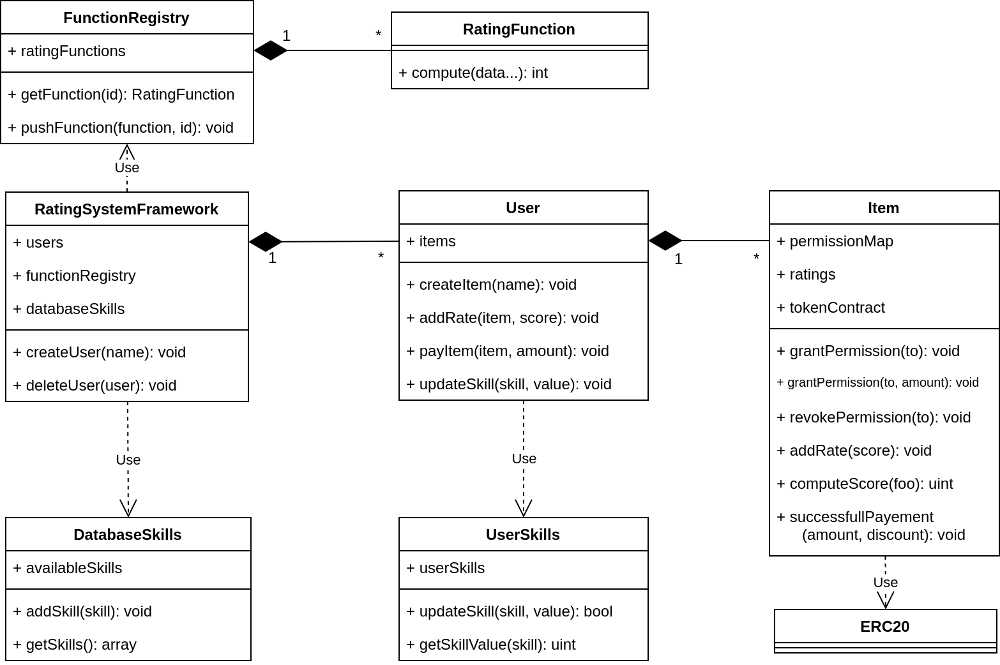

# Smart contracts for Rating platforms

## Goal

Create a set of smart contracts to support rating platforms (or recommender systems) like Tripadvisor. The smart contracts, intended to run on a public blockchain, offer the features of transparency and immutability, granting the possibility to audit and not repudiate the data stored. The downsides are the performance, the fees and the limited amount of data that can be stored on a public chain.

## Nomenclature

- **User**: a user of a rating platform;
- **Item**: the content of a rating platform (e.g. restaurant on Tripadvisor);
- **Skill**: a keywork identifying the property of an item (if the item is a restaurant, a skill can be "Vegan cousine"; if an item is a company, the skill can be "Tech company");
- **Experience**: the "reputation" a user has on a particular skill. The experience improves every time a user rates an item.
- **RatingFunction**: function computing the final score of an Item given all its ratings as input. The usage of such functions follows the [Strategy design pattern](https://it.wikipedia.org/wiki/Strategy_pattern). Examples:
    - Simple average on the item scores;
    - Weighted average on the blocks (time): newer ratings have more impact;
    - Weighted average on the experience: higher experienced ratings have more impact;
    - A weighted combination of the above. 

## Overview

The smart contract build up a system, with an entry point called RSF (Rating System Framework). People have to register themselves in order to publish items (contents) or rate existing items and become users. Item owners (users) can give permissions to rate their items to customers (users as well): both permissions grant, revoke and ratings are stored on the smart contracts, thus on the blockchain.

The ratings can be read and used to compute the item final score by smart contracts called RatingFunctions. A rating function can implements any formulas, for example a simple average or weighted average on certain parameters.

Moreover, the smart contracts provide the concept of "skill", i.e. a keyword identifying the property of an item. When a user rates an item he collects experience on the item's skill. If the user has high enough experience on the rated item's skill the user receives a discount proportional to the experience: the discount is represented by ERC20 tokens and can be used only on the item that issued them. However, being ERC20 compliant, such tokens are interchangeable across the Ethereum network.

## Features

- Basic access control mechanism to store a rating;
- Store the ratings of an Item;
- Provide RatingFunctions to compute the score of the items according to customizable formulas;
- Provide the skill system for the computation of the discount;
- Issue ERC20 compliant tokens to implement the discount mechanism.

## Class diagram

## Installation and usage

### Requirements 

- nodeJs and npm
- Truffle framework: [website](https://www.trufflesuite.com/)
    - ``npm -g install truffle`` (may require ``sudo``)
- Ethereum local testnet: [Ganache](https://www.trufflesuite.com/ganache) (GUI) or [ganache-cli](https://github.com/trufflesuite/ganache-cli) (CLI)

### Installation

    npm install

The ``package.json`` includes utility packages for the framework, such as ``truffle-hdwallet-provider`` to interact with Ethereum online test networks, and the [openzeppelin contracts](https://github.com/OpenZeppelin/openzeppelin-contracts).
- Tutorial with Truffle and Infura as provider: [read here](https://www.trufflesuite.com/tutorials/using-infura-custom-provider).

### Workflow

- Compile the contracts in ``contracts/``
    - ``truffle compile``
- Migrate (deploy) the contracts to the target network
    - ``truffle migrate --network <network name>``
    - The code provides 2 networks: *development* and *ropsten*.
- Testing
    - ``truffle test --network <network name>``
    - The provided tests work with the migration script targeting the *development* network.

### Future works

- Refactor the system:
    - Reduce the gas cost by applying patterns (e.g. the factory pattern to avoid new());
    - Are there components, or functions, not usefult for an Ethereum based application?
- Explore the usage of HTLC (Hash Time Locked Contracts) for the atomic  exchange of rating / tokens ([ref1](https://medium.com/liquality/hash-time-locked-contracts-htlcs-explained-e88aa99cc824),  [ref2](https://en.bitcoin.it/wiki/Hash_Time_Locked_Contracts),  [atomic swaps](https://dl.acm.org/citation.cfm?id=3212736));
- Explore privacy issues;
- Explore vulnerabilities and abuses:
    - Fake review problem;
    - Get too rich with discounts;
    - Sell review with an high experienced account;

## Authors
Andrea Lisi: [0Alic](https://github.com/0Alic)

Samuel Fabrizi: [samuelfabrizi](https://github.com/samuelfabrizi)

## License
[MIT license](https://opensource.org/licenses/mit-license.php)